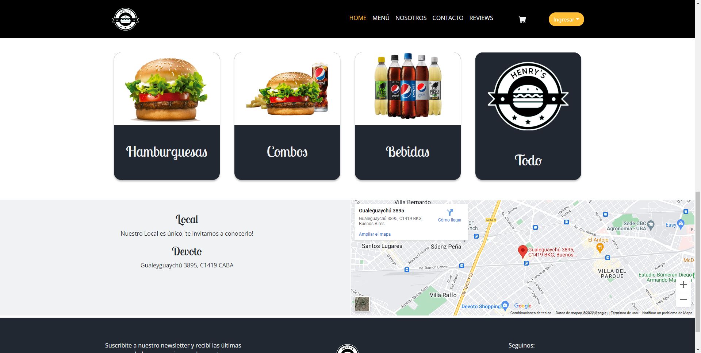
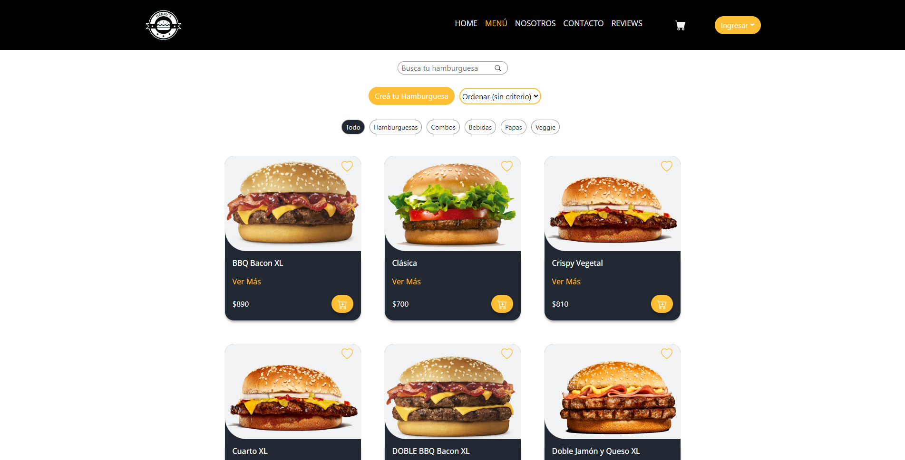
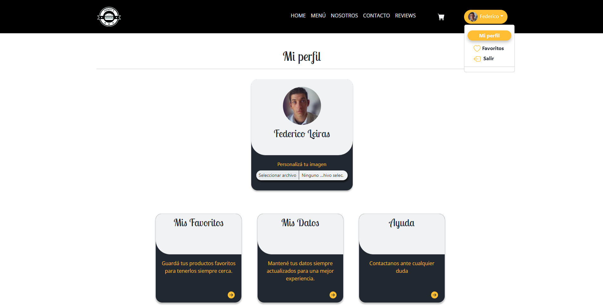
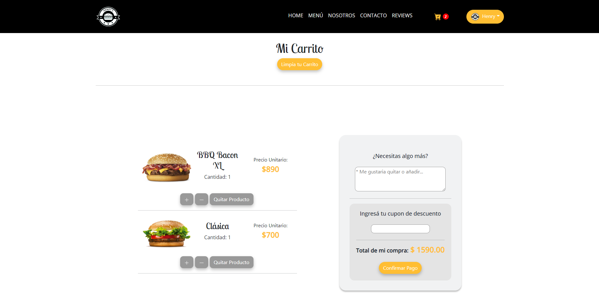

# Grupal Project - Henry

  

## Objetivos del Proyecto

- Construir una App de tipo Ecommerce.
- Afirmar y conectar los conceptos aprendidos en la carrera.
- Aprender mejores prácticas.
- Perfeccionar el workflow de GIT.
- Mejorar Metodologias Agiles (Scrum).

## Mi desempeño

- Desarrollo Front End.
- Stack Utilizado por mi:
- JavaScript
- React.js
- Redux
- Como aporte adicional realize la configuración de conección entre el Front del proyecto y la Base de Datos en Heroku y la implementación de la pasarela de pagos del mismo (MercadoPago).

  

  

  

  

